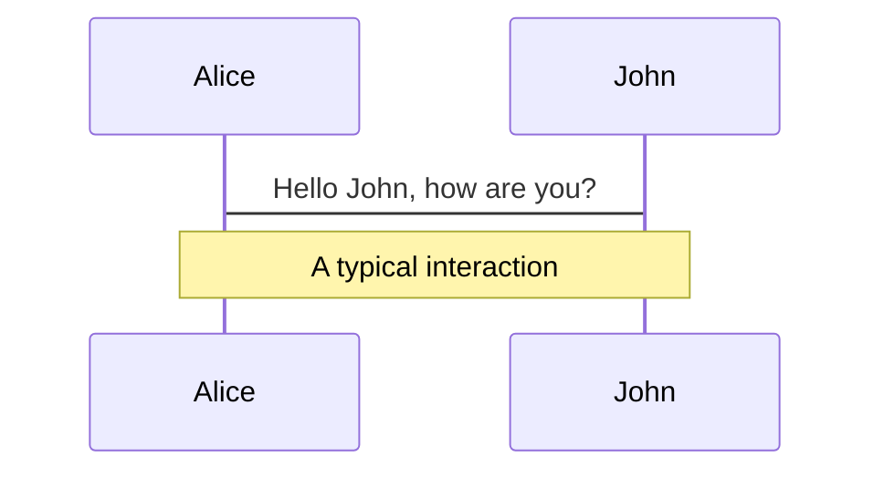
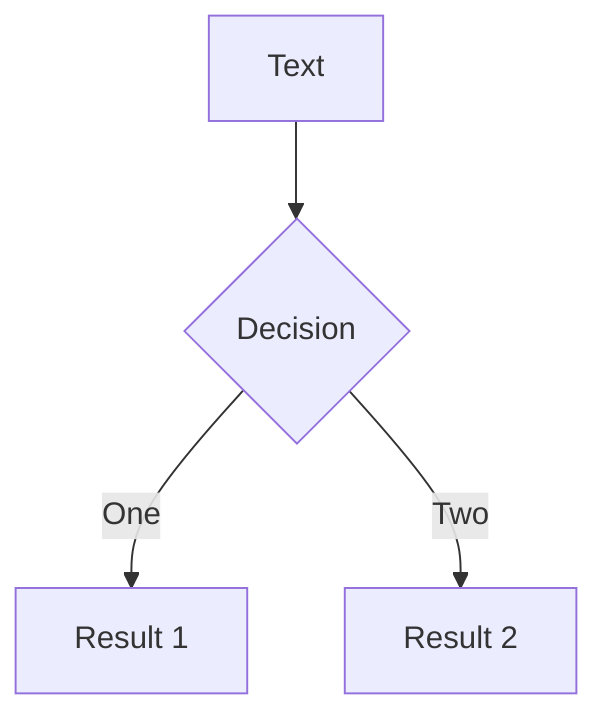
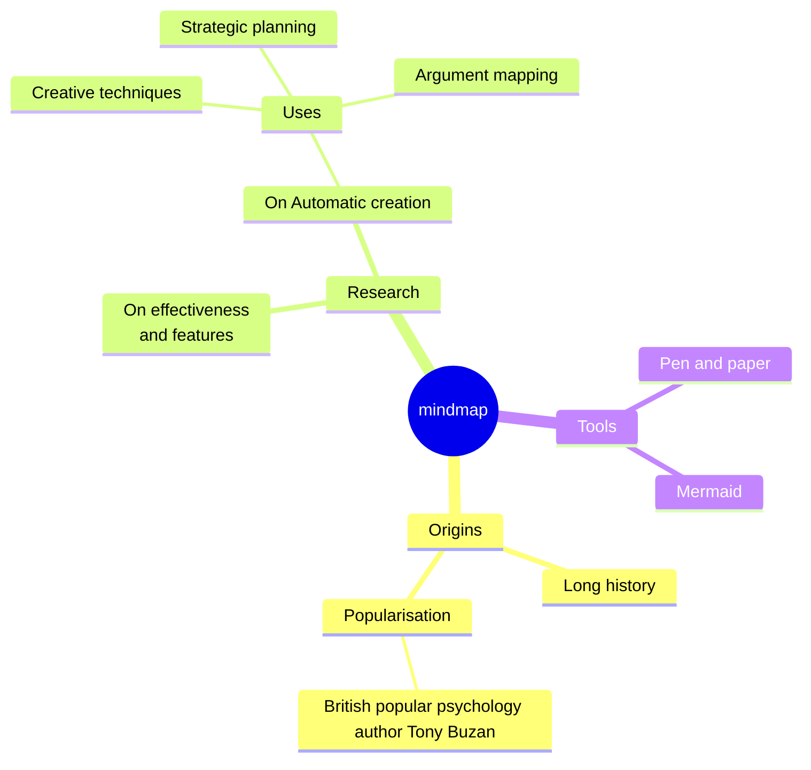
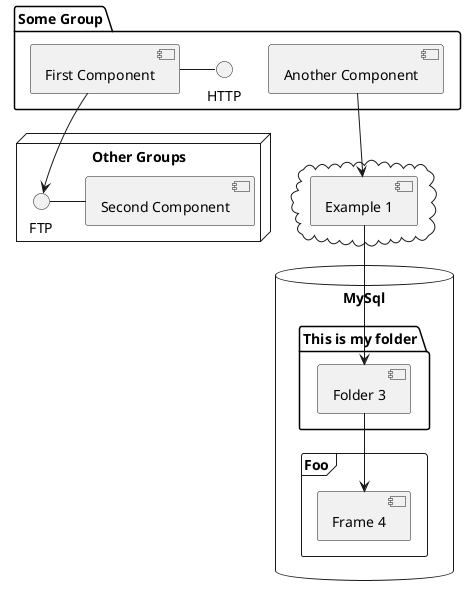

---
# You can also start simply with 'default'
theme: academic
# random image from a curated Unsplash collection by Anthony
# like them? see https://unsplash.com/collections/94734566/slidev
background: https://cover.sli.dev
# some information about your slides (markdown enabled)
title: Welcome to Slidev
info: |
  ## Slidev Starter Template
  Presentation slides for developers.

  Learn more at [Sli.dev](https://sli.dev)
# apply unocss classes to the current slide
class: text-center
# https://sli.dev/custom/highlighters.html
highlighter: shiki
# https://sli.dev/guide/drawing
drawings:
  persist: false
# slide transition: https://sli.dev/guide/animations#slide-transitions
transition: slide-left
# enable MDC Syntax: https://sli.dev/guide/syntax#mdc-syntax
mdc: true


authors:  # First author should be the presenter
  - First Author: ["Institution 1", "Institution 2"]
  - Second Author: ["Institution 3"]
  - Third Author: ["Institution 1", "Institution 3"] 

meeting: "presentation meeting"
preTitle: "An Example Title"
---

## Maximizing Failure Resistance of Periodic and Aperiodic Architected Materials

<h4><u> Markus Tandrup Holm </u>, Konstantinos Poulios, Niels Aage and Ole Sigmund </h4>

<h5> Department of Civil and Mechanical Engineering, Solid Mechanics, Technical University of Denmark</h5>

<p> ICTAM 2024 </p>


<LightOrDark>
  <template #dark="props">
     
  </template>
  <template #light="props">
    
  </template>
</LightOrDark>

<LightOrDark>
  <template #dark="props">
    
  </template>
  <template #light="props">
    
  </template>
</LightOrDark>

<!--
The last comment block of each slide will be treated as slide notes. It will be visible and editable in Presenter Mode along with the slide. [Read more in the docs](https://sli.dev/guide/syntax.html#notes)
-->


<!--
Here is another comment.
-->

----

# Architected materials

- What: Lattice structures (img)
- Goal: Obtain light structures while retaining performance in terms of stiffness, strength, 
- Can be tailored for the specific need 
- Enabled by advances in additive manufacturing (3D printing) of metal alloys and polymers
- However, still an active research area in terms of both design and especially manufacturing (avoiding severe defects and large tolerances)
- Defect free design is probably impossible, so the optimal design must be tolerant/robust to crack propagation. 


1. (Add example image of printed structures)
2. (Add example image of Ashby? chart, density and stifness, and density and e.g. fracture toughness or energy absorbtion)
3. (Add cool video of laser sintering (or whatever it is called))

<!-- 
<figure style="position:fixed; top:210px; left:100px" >
  
  <figcaption> <p style="font-size: small; font-weight: lighter"> Super-long suspension bridge <sup>1</sup> </p> </figcaption>
</figure> 

 -->

<!-- <Footnotes separator>
  <Footnote :number=5><a href="http://dx.doi.org/10.1038/s41467-020-16599-6" rel="noreferrer" target="_blank">Baandrup 2020</a></Footnote>
</Footnotes>  -->

Markus Tandrup Holm - ICTAM 2024 {class="absolute inset-x-0 bottom--4 bg-sky-900 text-white p-0.0 text-right px-10 text-xs"}

Technical University of Denmark - AMSTRAD - Villum Foundation {class="absolute inset-x-0 bottom--4 text-white text-left px-10 text-xs"}

<!-- 

add notes here

-->

---

# Failure resistance

- Cracks will occur or is already present from manufacturing technology (sintering, laser welding). So how do we handle them?

- Defining the objective (what is the goal?): 

- Energy absorbtion (total fracture property), can be viewed as the 'average' resistance against cracks
- Fracture toughness (instantanous property, defines strength in cases where buckling is not considered but is also local in time, i.e. it does not account for what happens next). How is it defined absolute or relative?

- Optimality only exists under some objective, so this is key. However, many conceptions can be found regarding what is actually the desired property. This leads to confusion and the risk that designs are selected for the wrong reason.

- Some objectives are easy to define (Stiffness maximization), failure resistance is NOT. So we must choose the objective carefully


Markus Tandrup Holm - ICTAM 2024 {class="absolute inset-x-0 bottom--4 bg-sky-900 text-white p-0.0 text-right px-10 text-xs"}

Technical University of Denmark - AMSTRAD - Villum Foundation {class="absolute inset-x-0 bottom--4 text-white text-left px-10 text-xs"}


<!--

add notes here

-->

---
layout: two-cols-header
---

# Optimization problem (single)

$$
\begin{align*}
\max_{\mathbf{x}} \quad & W_f = \frac{1}{2} \lambda^2 U P_0 \\
\text{s.t.}       \quad & \mathbf{K} \mathbf{u} = \mathbf{f}, \\
                  \quad & g_{iso}(\mathbf{C}^H_{UC}) \leq 0, \\
                  \quad & \frac{V}{V_0 V^\ast} - 1 \leq 0, \\
                  \quad & x_{\min} \leq x^e \leq x_{\max} \quad e = 1,\dots,N_e,
\end{align*}
$$


Markus Tandrup Holm - ICTAM 2024 {class="absolute inset-x-0 bottom--4 bg-sky-900 text-white p-0.0 text-right px-10 text-xs"}

Technical University of Denmark - AMSTRAD - Villum Foundation {class="absolute inset-x-0 bottom--4 text-white text-left px-10 text-xs"}


---

<div
  v-click="[1, 10]" v-motion
  :enter="{ x: 200, y: 0 }"
  :click-1="{ x: 0, y: 0 }"
  :click-2="{ y: 200 }"
  :click-3="{ x: 166 }"
>
  
</div>


<div
  v-click="[4, 10]" v-motion
  :enter="{ x: 0, y: 0 }"
  :click-4="{ x: 0, y: 0 }"
  :click-5="{ y: 200 }"
  >
  
</div>

<div
  v-click="[6, 10]" v-motion
  :enter="{ x: 0, y: 0 }"
  :click-6="{ x: 0, y: 0 }"
  :click-7="{ x: 83, y: 56.5 }"
  >
  
</div>

<div
  v-click="[8, 10]" v-motion
  :enter="{ x: 0, y: 0 }"
  :click-8="{ y: 0 }"
  :click-9="{ x: 249, y: 56.5 }"
  >
  
</div>

---


<!-- <div v-click.hide>
<figure style="position:fixed; top:200px; right:10px; display: table" >
  <SlidevVideo autoreset="slide" muted
   style="position:relative; top:0px; left:0px; width:450px">
    <source src="/media/parameter_study/UnitCell_le_0.062_vfrac_0.25_p_8_qthk_3.0_nuc_3_q_sig_ramp_0.25_cmp.mp4" type="video/mp4">
  </SlidevVideo> 
</figure> 
</div>

<figure style="position:fixed; top:215px; right:10px; display: table" >
  <SlidevVideo v-after autoplay autoreset="click" muted
   style="position:relative; top:0px; left:0px; width:450px">
    <source src="/media/parameter_study/UnitCell_le_0.062_vfrac_0.25_p_8_qthk_3.0_nuc_3_q_sig_ramp_0.25_cmp.mp4" type="video/mp4">
  </SlidevVideo> 
</figure>  -->

<!--
add notes here
-->


---
transition: fade-out
---

# What is Slidev?

Slidev is a slides maker and presenter designed for developers, consist of the following features

- 📝 **Text-based** - focus on the content with Markdown, and then style them later
- 🎨 **Themable** - themes can be shared and re-used as npm packages
- 🧑‍💻 **Developer Friendly** - code highlighting, live coding with autocompletion
- 🤹 **Interactive** - embed Vue components to enhance your expressions
- 🎥 **Recording** - built-in recording and camera view
- 📤 **Portable** - export to PDF, PPTX, PNGs, or even a hostable SPA
- 🛠 **Hackable** - virtually anything that's possible on a webpage is possible in Slidev
<br>
<br>

Read more about [Why Slidev?](https://sli.dev/guide/why)


<!--
You can have `style` tag in markdown to override the style for the current page.
Learn more: https://sli.dev/guide/syntax#embedded-styles
-->

<style>
h1 {
  background-color: #2B90B6;
  background-image: linear-gradient(45deg, #4EC5D4 10%, #146b8c 20%);
  background-size: 100%;
  -webkit-background-clip: text;
  -moz-background-clip: text;
  -webkit-text-fill-color: transparent;
  -moz-text-fill-color: transparent;
}
</style>

---
transition: slide-up
level: 2
---

# Navigation

Hover on the bottom-left corner to see the navigation's controls panel, [learn more](https://sli.dev/guide/navigation.html)

## Keyboard Shortcuts

|     |     |
| --- | --- |
| <kbd>right</kbd> / <kbd>space</kbd>| next animation or slide |
| <kbd>left</kbd>  / <kbd>shift</kbd><kbd>space</kbd> | previous animation or slide |
| <kbd>up</kbd> | previous slide |
| <kbd>down</kbd> | next slide |

<!-- https://sli.dev/guide/animations.html#click-animations -->

<p v-after class="absolute bottom-23 left-45 opacity-30 transform -rotate-10">Here!</p>

---
layout: two-cols
layoutClass: gap-16
---

# Table of contents

You can use the `Toc` component to generate a table of contents for your slides:

```html
<Toc minDepth="1" maxDepth="1"></Toc>
```

The title will be inferred from your slide content, or you can override it with `title` and `level` in your frontmatter.

::right::

<Toc v-click minDepth="1" maxDepth="2"></Toc>


---
layout: image-right
image: https://cover.sli.dev
---

# Code

Use code snippets and get the highlighting directly, and even types hover![^1]

```ts {all|5|7|7-8|10|all} twoslash
// TwoSlash enables TypeScript hover information
// and errors in markdown code blocks
// More at https://shiki.style/packages/twoslash

import { computed, ref } from 'vue'

const count = ref(0)
const doubled = computed(() => count.value * 2)

doubled.value = 2
```

<arrow v-click="[4, 5]" x1="350" y1="310" x2="195" y2="334" color="#953" width="2" arrowSize="1" />

<!-- This allow you to embed external code blocks -->
<<< @/snippets/external.ts#snippet

<!-- Footer -->
[^1]: [Learn More](https://sli.dev/guide/syntax.html#line-highlighting)

<!-- Inline style -->
<style>
.footnotes-sep {
  @apply mt-5 opacity-10;
}
.footnotes {
  @apply text-sm opacity-75;
}
.footnote-backref {
  display: none;
}
</style>

<!--
Notes can also sync with clicks

[click] This will be highlighted after the first click

[click] Highlighted with `count = ref(0)`

[click:3] Last click (skip two clicks)
-->

---
level: 2
---

# Shiki Magic Move

Powered by [shiki-magic-move](https://shiki-magic-move.netlify.app/), Slidev supports animations across multiple code snippets.

Add multiple code blocks and wrap them with <code>````md magic-move</code> (four backticks) to enable the magic move. For example:

````md magic-move {lines: true}
```ts {*|2|*}
// step 1
const author = reactive({
  name: 'John Doe',
  books: [
    'Vue 2 - Advanced Guide',
    'Vue 3 - Basic Guide',
    'Vue 4 - The Mystery'
  ]
})
```

```ts {*|1-2|3-4|3-4,8}
// step 2
export default {
  data() {
    return {
      author: {
        name: 'John Doe',
        books: [
          'Vue 2 - Advanced Guide',
          'Vue 3 - Basic Guide',
          'Vue 4 - The Mystery'
        ]
      }
    }
  }
}
```

```ts
// step 3
export default {
  data: () => ({
    author: {
      name: 'John Doe',
      books: [
        'Vue 2 - Advanced Guide',
        'Vue 3 - Basic Guide',
        'Vue 4 - The Mystery'
      ]
    }
  })
}
```

Non-code blocks are ignored.

```vue
<!-- step 4 -->
<script setup>
const author = {
  name: 'John Doe',
  books: [
    'Vue 2 - Advanced Guide',
    'Vue 3 - Basic Guide',
    'Vue 4 - The Mystery'
  ]
}
</script>
```
````

---

# Components

<div grid="~ cols-2 gap-4">
<div>

You can use Vue components directly inside your slides.

We have provided a few built-in components like `<Tweet/>` and `<Youtube/>` that you can use directly. And adding your custom components is also super easy.

```html
<Counter :count="10" />
```

<!-- ./components/Counter.vue -->
<Counter :count="10" m="t-4" />

Check out [the guides](https://sli.dev/builtin/components.html) for more.

</div>
<div>

```html
<Tweet id="1390115482657726468" />
```

<Tweet id="1390115482657726468" scale="0.65" />

</div>
</div>

<!--
Presenter note with **bold**, *italic*, and ~~striked~~ text.

Also, HTML elements are valid:
<div class="flex w-full">
  <span style="flex-grow: 1;">Left content</span>
  <span>Right content</span>
</div>
-->

---
class: px-20
---

# Themes

Slidev comes with powerful theming support. Themes can provide styles, layouts, components, or even configurations for tools. Switching between themes by just **one edit** in your frontmatter:

<div grid="~ cols-2 gap-2" m="t-2">

```yaml
---
theme: default
---
```

```yaml
---
theme: seriph
---
```


</div>

Read more about [How to use a theme](https://sli.dev/themes/use.html) and
check out the [Awesome Themes Gallery](https://sli.dev/themes/gallery.html).

---

# Clicks Animations

You can add `v-click` to elements to add a click animation.

<div v-click>

This shows up when you click the slide:

```html
<div v-click>This shows up when you click the slide.</div>
```

</div>

<br>

<v-click>

The <span v-mark.red="3"><code>v-mark</code> directive</span>
also allows you to add
<span v-mark.circle.orange="4">inline marks</span>
, powered by [Rough Notation](https://roughnotation.com/):

```html
<span v-mark.underline.orange>inline markers</span>
```

</v-click>

<div mt-20 v-click>

[Learn More](https://sli.dev/guide/animations#click-animations)

</div>

---

# Motions

Motion animations are powered by [@vueuse/motion](https://motion.vueuse.org/), triggered by `v-motion` directive.

```html
<div
  v-motion
  :initial="{ x: -80 }"
  :enter="{ x: 0 }"
  :click-3="{ x: 80 }"
  :leave="{ x: 1000 }"
>
  Slidev
</div>
```

<div class="w-60 relative">
  <div class="relative w-40 h-40">
    
    
    
  </div>

  <div
    class="text-5xl absolute top-14 left-40 text-[#2B90B6] -z-1"
    v-motion
    :initial="{ x: -80, opacity: 0}"
    :enter="{ x: 0, opacity: 1, transition: { delay: 2000, duration: 1000 } }">
    Slidev
  </div>
</div>

<!-- vue script setup scripts can be directly used in markdown, and will only affects current page -->
<script setup lang="ts">
const final = {
  x: 0,
  y: 0,
  rotate: 0,
  scale: 1,
  transition: {
    type: 'spring',
    damping: 10,
    stiffness: 20,
    mass: 2
  }
}
</script>

<div
  v-motion
  :initial="{ x:35, y: 30, opacity: 0}"
  :enter="{ y: 0, opacity: 1, transition: { delay: 3500 } }">

[Learn More](https://sli.dev/guide/animations.html#motion)

</div>

---

# LaTeX

LaTeX is supported out-of-box. Powered by [KaTeX](https://katex.org/).

<div h-3 />

Inline $\sqrt{3x-1}+(1+x)^2$

Block
$$ {1|3|all}
\begin{aligned}
\nabla \cdot \vec{E} &= \frac{\rho}{\varepsilon_0} \\
\nabla \cdot \vec{B} &= 0 \\
\nabla \times \vec{E} &= -\frac{\partial\vec{B}}{\partial t} \\
\nabla \times \vec{B} &= \mu_0\vec{J} + \mu_0\varepsilon_0\frac{\partial\vec{E}}{\partial t}
\end{aligned}
$$

[Learn more](https://sli.dev/guide/syntax#latex)

---

# Diagrams

You can create diagrams / graphs from textual descriptions, directly in your Markdown.

<div class="grid grid-cols-4 gap-5 pt-4 -mb-6">









</div>

[Learn More](https://sli.dev/guide/syntax.html#diagrams)

---
foo: bar
dragPos:
  square: 641,40,167,_
---

# Draggable Elements

Double-click on the draggable elements to edit their positions.

<br>

###### Directive Usage

```md

```

<br>

###### Component Usage

```md
<v-drag text-3xl>
  <carbon:arrow-up />
  Use the `v-drag` component to have a draggable container!
</v-drag>
```

<v-drag pos="663,206,261,_,-15">
  <div text-center text-3xl border border-main rounded>
    Double-click me!
  </div>
</v-drag>


###### Draggable Arrow

```md
<v-drag-arrow two-way />
```

<v-drag-arrow pos="67,452,253,46" two-way op70 />

---
src: ./pages/multiple-entries.md
hide: false
---

---

# Monaco Editor

Slidev provides built-in Monaco Editor support.

Add `{monaco}` to the code block to turn it into an editor:

```ts {monaco}
import { ref } from 'vue'
import { emptyArray } from './external'

const arr = ref(emptyArray(10))
```

Use `{monaco-run}` to create an editor that can execute the code directly in the slide:

```ts {monaco-run}
import { version } from 'vue'
import { emptyArray, sayHello } from './external'

sayHello()
console.log(`vue ${version}`)
console.log(emptyArray<number>(10).reduce(fib => [...fib, fib.at(-1)! + fib.at(-2)!], [1, 1]))
```

---
layout: center
class: text-center
---

# Learn More

[Documentation](https://sli.dev) · [GitHub](https://github.com/slidevjs/slidev) · [Showcases](https://sli.dev/showcases.html)

<PoweredBySlidev mt-10 />
